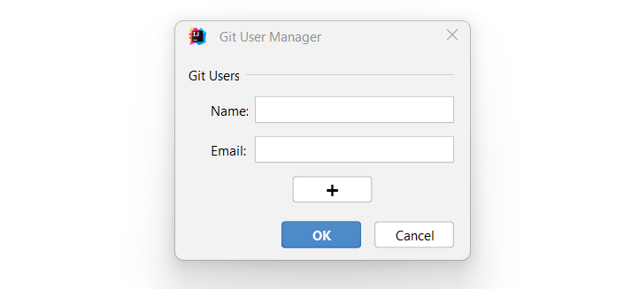

# git-user-manager
Intellij IDEA plugin for managing git global users.

**VCS (Git)**:
* Manage Git Users - action for manage git users in Intellij IDEA for all projects.
* Switch Git User (Ctrl + \, Ctrl + Z) - action for switch git global user for all projects.
 

